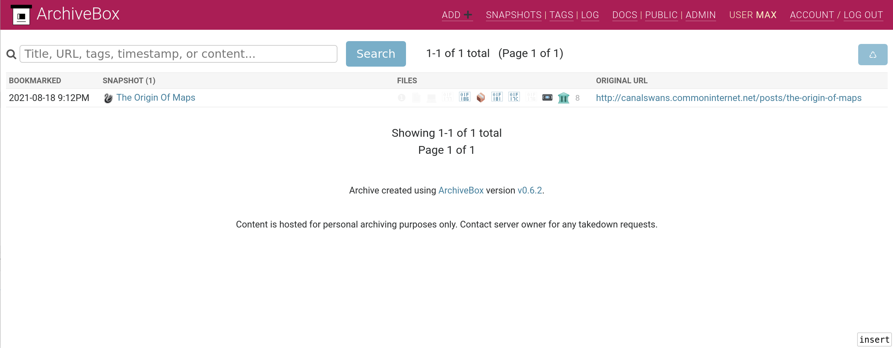

# ArchiveBox pour YunoHost

[](https://dash.yunohost.org/appci/app/archivebox)    
[](https://install-app.yunohost.org/?app=archivebox)

*[Read this readme in english.](./README.md)*
*[Lire ce readme en français.](./README_fr.md)*

> *Ce package vous permet d'installer ArchiveBox rapidement et simplement sur un serveur YunoHost.
Si vous n'avez pas YunoHost, regardez [ici](https://yunohost.org/#/install) pour savoir comment l'installer et en profiter.*

## Vue d'ensemble


**Version incluse :** 0.6.2~ynh8

**Démo :** https://archiveboxdemo.commoninternet.net

## Captures d'écran



## Avertissements / informations importantes

* Any known limitations, constrains or stuff not working:
    * required to be run at the base path / , subpaths not yet supported
    * currently only tested on amd64
    * haven't yet implemented single-sign or LDAP integration 


## Documentations et ressources

* Site officiel de l'app : https://archivebox.io/
* Documentation officielle de l'admin : https://github.com/ArchiveBox/ArchiveBox/wiki
* Dépôt de code officiel de l'app : https://github.com/ArchiveBox/ArchiveBox
* Documentation YunoHost pour cette app : https://yunohost.org/app_archivebox
* Signaler un bug : https://github.com/YunoHost-Apps/archivebox_ynh/issues

## Informations pour les développeurs

Merci de faire vos pull request sur la [branche testing](https://github.com/YunoHost-Apps/archivebox_ynh/tree/testing).

Pour essayer la branche testing, procédez comme suit.
```
sudo yunohost app install https://github.com/YunoHost-Apps/archivebox_ynh/tree/testing --debug
ou
sudo yunohost app upgrade archivebox -u https://github.com/YunoHost-Apps/archivebox_ynh/tree/testing --debug
```

**Plus d'infos sur le packaging d'applications :** https://yunohost.org/packaging_apps